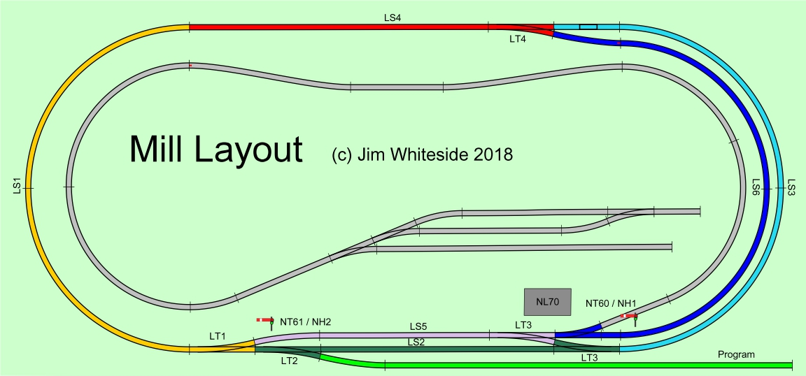

# Layout

DCC system is NCE PowerCab with ... Dapol semaphore signals driven by a Train-Tech SC3 Dual Dapol Semaphore Signal Controller (see [video](https://youtu.be/QDprT0TlBVI)) (NT60 / NT61 and corresponding 'heads' NH1 / NH2), led lights in the signal box using another Train-Tech controller (NL70).

Turnouts and block detection etc. uses [RR-Cirkits SignalMan](http://www.rr-cirkits.com/description/index.html) LocoBuffer USB - turnouts are LT*, block detection is LS*
